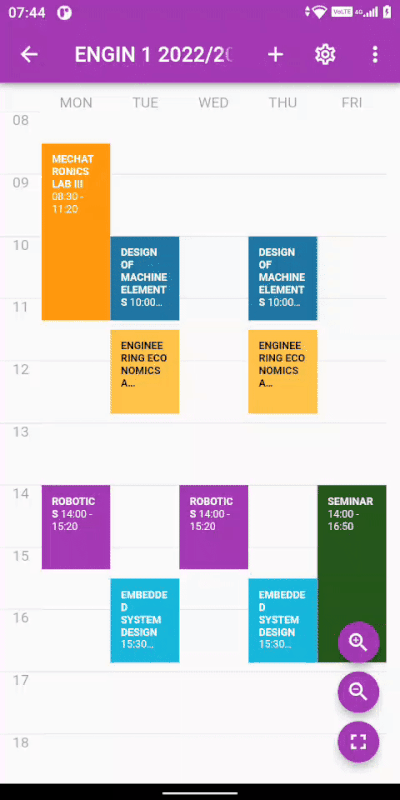
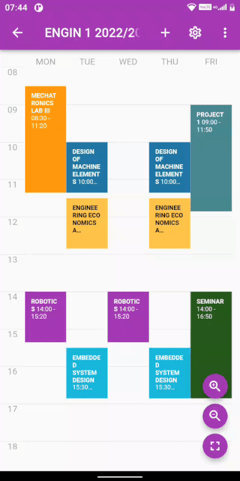
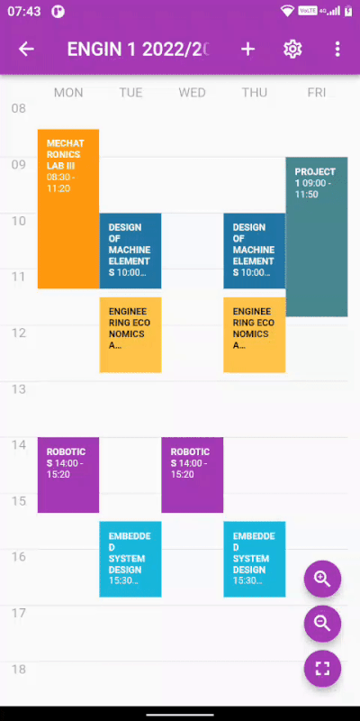
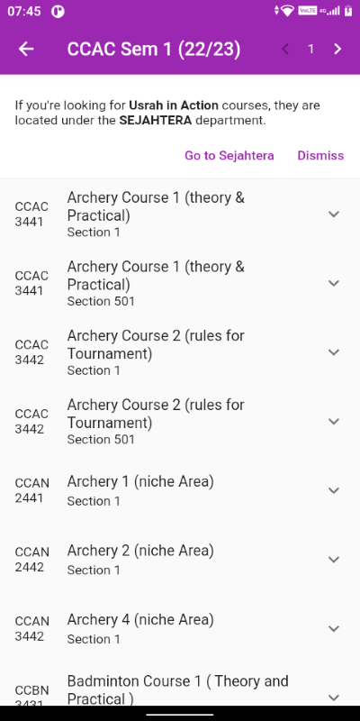
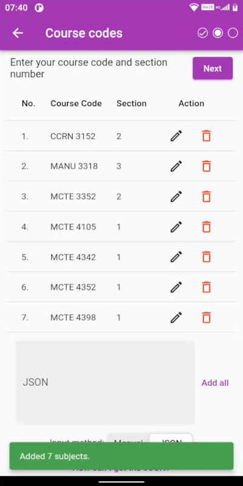
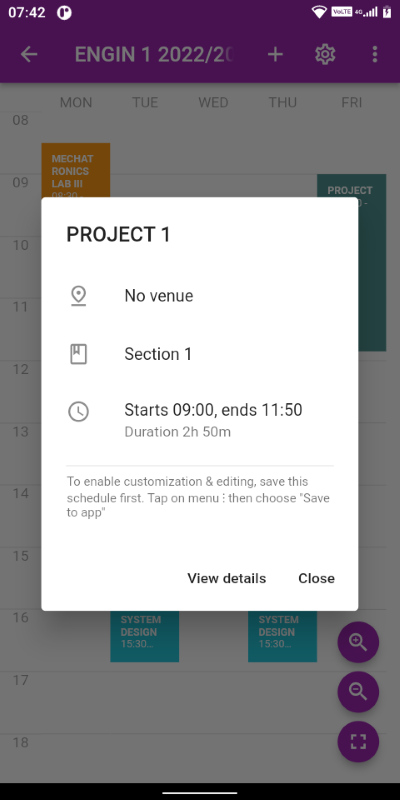

## Changelog

Responding to your feedback & suggestions, I've added the following:

- :sparkles: Added ability to **edit saved subject**. Currently only changing **venue** property is possible. Partially fixes issue [#37](https://github.com/iqfareez/iium_schedule/issues/37)
 
  
- :sparkles: Added ability to **delete** individual saved subject. Issue [#37](https://github.com/iqfareez/iium_schedule/issues/37)
   
  
- :sparkles: Added ability to **add** subject. Fixes [#38](https://github.com/iqfareez/iium_schedule/issues/38)
     
  
- :sparkles: Add **Usrah in Action** prompt in COCU page in course browser, due to I think some of us can't find it and thinking the courses in not available in app.

  
- :sparkles: Kulliyyah other than main kulliyyah (eg: `COCU` etc), in course validator are now **automatically overriden**. So you won't need to override manually.

  
- :children_crossing: Add **hints** to save the schedule first before editing in schedule layout and its dialog. So you would no the schedule is customizable, but there is a need of some extra steps. Also, if you've
  noticed, I've added the **section information** in the dialog, so you would not accidentally enter the wrong class

  
- :children_crossing: Add **hint** in input scope to select the main kulliyyah. Initial implementation of [#41](https://github.com/iqfareez/iium_schedule/issues/41)
- :lipstick: Update button theme to **improve visibility** in dark mode
- :pencil2: Added **session** (academic year) and **semester** to **metadata dialog**.
- :bento: Update web `og:image` metatag asset
- :technologist: [DEV]
  - Add `uuid` (for future implementation), `session` and `semester` in SavedSchedule Hive object.

