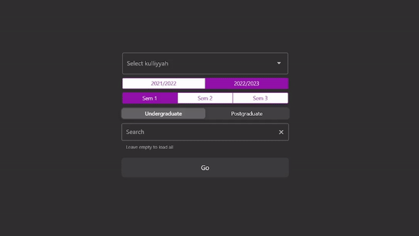

## Changelog

- :sparkles: Added support for **Postgraduate** studies. Postgraduate students can now browse for course or create schedule
using the app.
  
- :lipstick: Move the version number closer to the left
- :arrow_up: Upgrade dependencies
