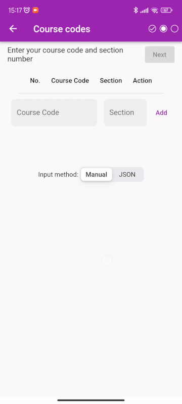

## Changelog

- :bug: Fixes issue where **some courses are failed to fetch** (eg: cocu/celpad) in schedule maker. Issue [#34](https://github.com/iqfareez/iium_schedule/issues/34). Thanks for the [heads up](https://twitter.com/ammarputeraa/status/1578780255833423872?s=20&t=IUCXf0DhgstoWb2jiZED-w).
- :children_crossing: Improve UX by **increasing the `maxLength` property** in input course. So user are be able to input course code with space without getting truncated. Thanks for the [suggestion](https://twitter.com/dannish__/status/1578824019834376193?s=20&t=IUCXf0DhgstoWb2jiZED-w).
  
  
