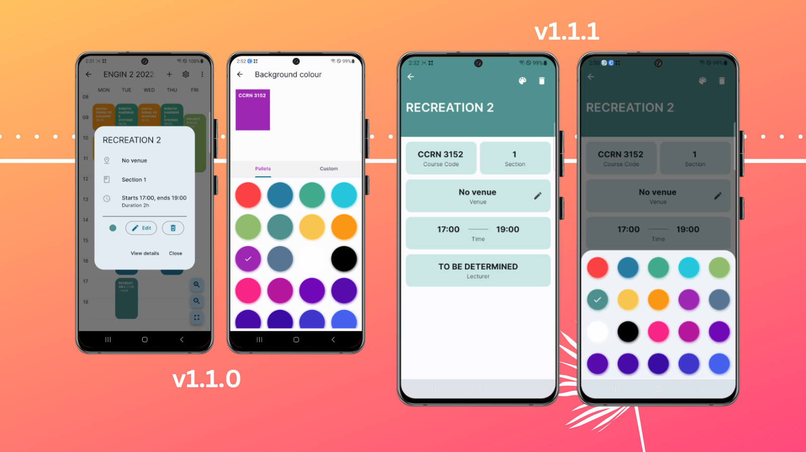
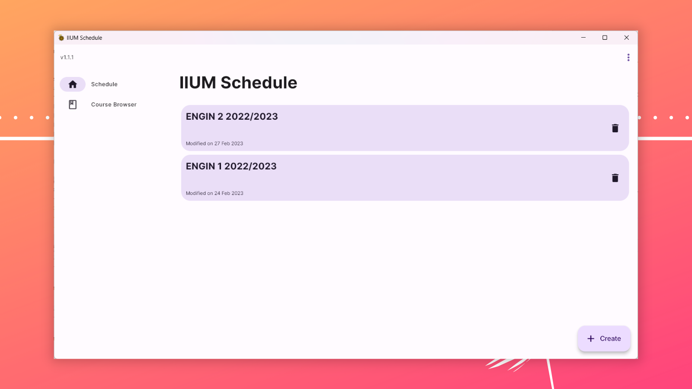

## What's New

- :lipstick: Redesigned **subject viewer** - Replaced the dialog with a full page (Only for saved schedule, for unsaved subject, the dialog remains)
  - Why? Because previously, when using dialog and user want to edit, the dialog will [glitch a bit](https://imgur.com/YE3S3AP.mp4). It was caused due to the widget rebuilds. This is bad for the UX, hence this changes. Plus, it looks nicer to the eyes too (in my opinion lah..)
    
- :iphone: **Responsive layout** - Adapt for wide screen devices (eg desktop or tablet) - this is just the beginning, I'm planning to _responsivenessify_ (make responsive) of other UI elements.
  
- :heavy_plus_sign: Upgrade dependencies
- :wrench: Exposes option to increase/decrease schedule text sizes for all platforms. For small screen devices, the option will be in the overflow menu. [[Screenshot]](https://imgur.com/vCZesI9.png)
- :art: System navigation bar now follow the app theme. Unfortunately, there is new issue from this change. See [known issues](#known-issues)
- :pencil2: Fixed incorrect tooltip label. [[Screenshot]](https://user-images.githubusercontent.com/60868965/221734345-efeb125c-823e-438d-adaa-40d1118f64a7.png)
- :pencil2: Removed stray `}` character in toast message.
- :technologist: [DEV]
  - Added [auto_size_text](https://pub.dev/packages/auto_size_text).
  - Refactor CI.

## Known issues

- While you can tap and hold the text you wanted to Copy, the option Copy will [not reappear](https://imgur.com/l123Cjw) _(bruh)_ when you resize the handler. This issue is tracked in [#68](https://github.com/iqfareez/iium_schedule/issues/68)
- Icon on system's bottom navigation bar may not be visible in some phones. Tracked in [#70](https://github.com/iqfareez/iium_schedule/issues/70)

---

