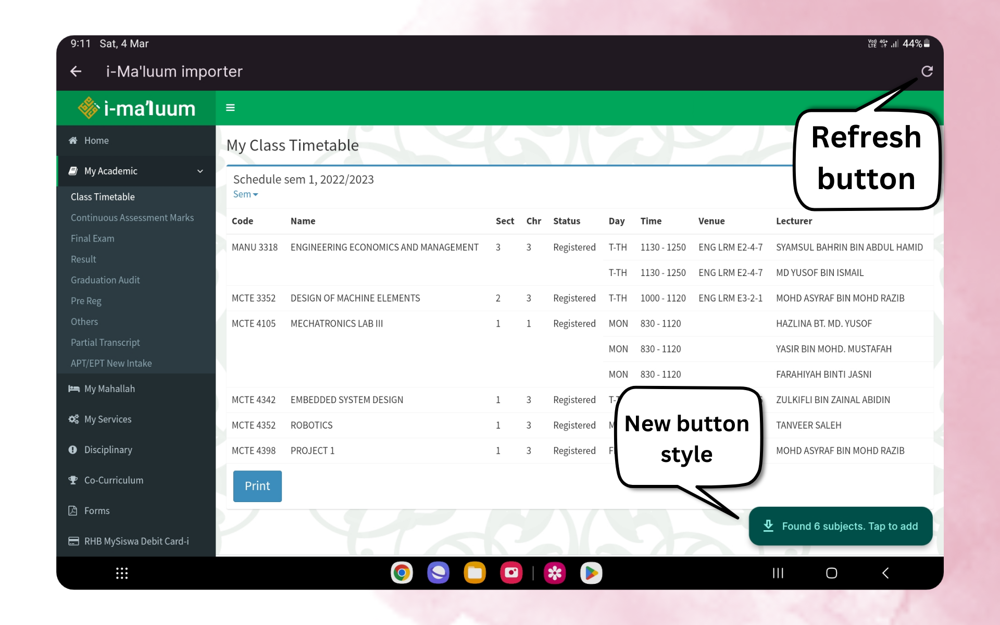

## What's New

- ✨ Added option to display **venue**, or **section**, or **default** (time) [#39](https://github.com/iqfareez/iium_schedule/issues/39)
    
- 🐛 Fixed some icons are that not tappable in subject page. [[Video]](https://imgur.com/KdwvjHD.mp4)
- 🐛 Fixed Material Banner cannot be dismissed from i-Ma'luum importer [#71](https://github.com/iqfareez/iium_schedule/issues/71).
- 🚸 Added refresh button in i-Ma'luum importer.
- 🎨 New button style for adding subject from i-Ma'luum importer.
    

- 🎨 Make subject padding smaller a bit to make some room to its content. cb03f9e
- 🔥 Removed <kbd>View details</kbd> button in subject dialog (I think it's no longer needed) [[Screenshot]](https://imgur.com/GJ28eTz.png). Also removed [admonitions](https://pub.dev/packages/admonitions) package
- ➕ Upgraded dependency - [html](https://pub.dev/packages/html)

___
