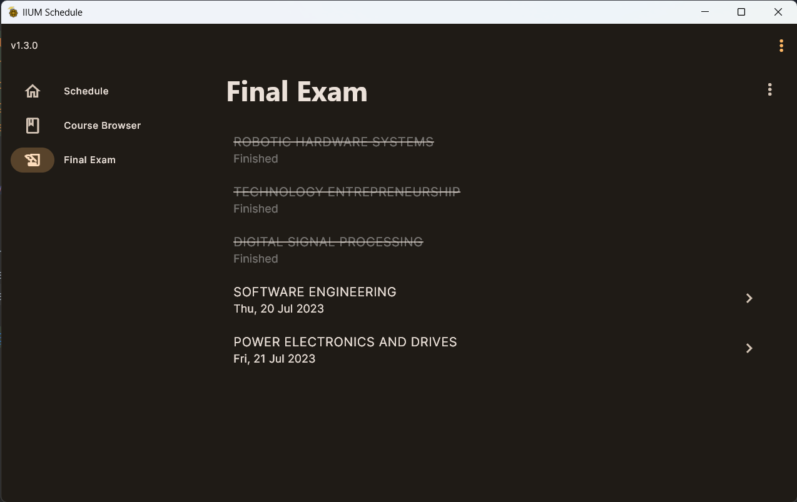

## What's Changed

- :new: Finished exam will now will be strikethrough instead of just removing them from the view.

    

- :arrow_up: Upgrade dependencies 
- :arrow_up: Bump minimum SDK version to 19 (Android 4.4 KitKat).

