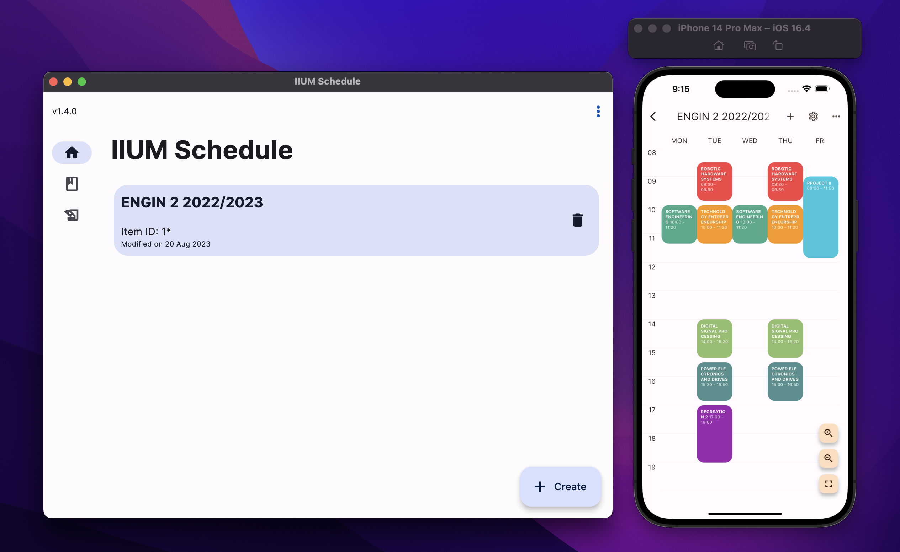
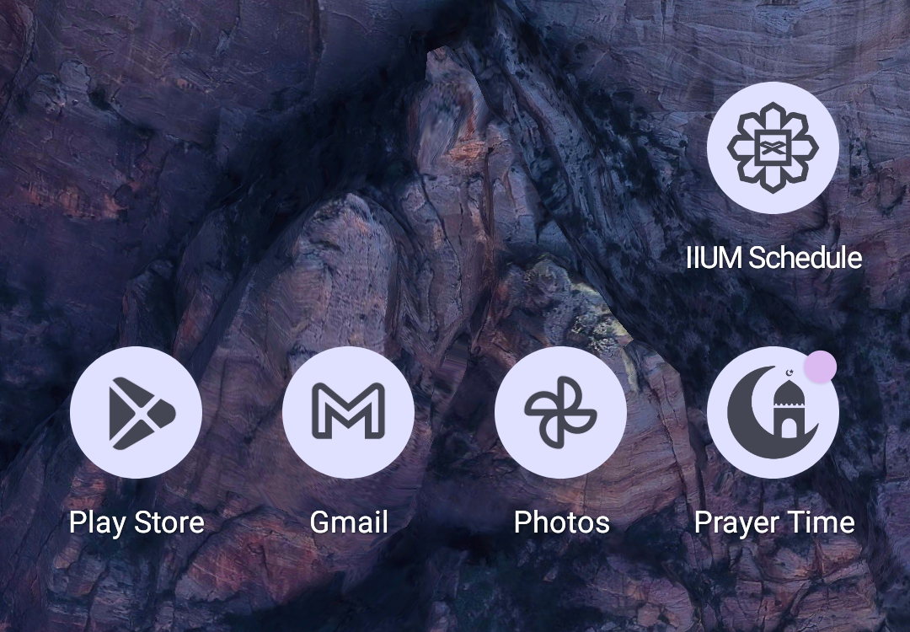
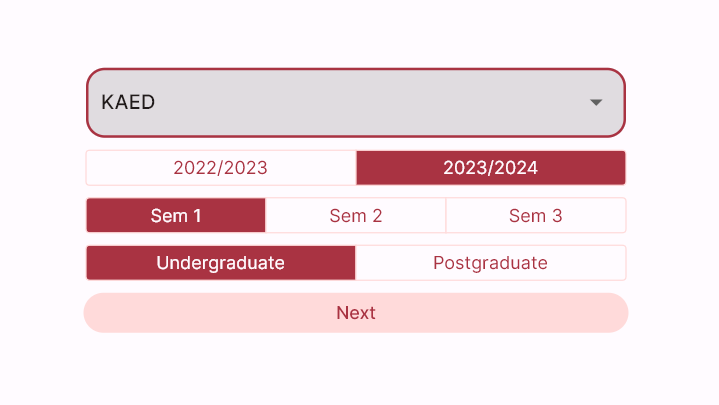

## Highlight

🎉 Added support for **MacOS**. Now you can install IIUM Schedule on your Macbook! Download the app [here](/downloads#macos).

:::note Disclaimer

Despite the screenshot above includes iPhone, IIUM Schedule is not available on iOS (not published to App Store).
You can try deploying to your device on your own. 

:::

## New features

- :sparkles: Added **highlight for current day** in schedule view. [#74](https://github.com/iqfareez/iium_schedule/issues/74)
- :bento: Added support for **[themed icons](https://9to5google.com/2023/03/02/create-themed-icons-for-any-app/)** (Available on Android 13+). When themed icons is enabled from the system settings, the 
app icon will follow the device themes.
  

## Other changes

- :pencil2: New default when selecting session & semester - **Session: 2023/2024, Semester: 1**
  
- :lipstick: Fix some minor isues in UI

