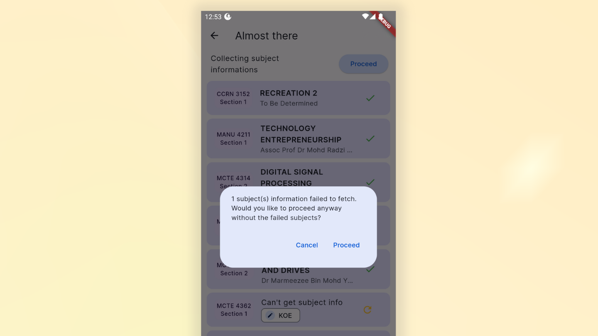
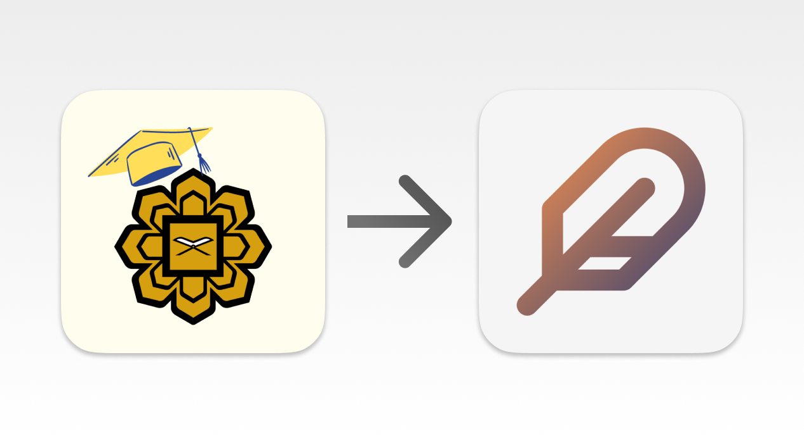

- :sparkles: Add ability to just **skip** the *failed to fetch subjects* in schedule maker. Previously, user could stuck in this page
if one or more subject data is not available

- :lipstick: Update **Update checker** page UI
- :bento: Update app icons

- :pencil2: Update default semester to 2

