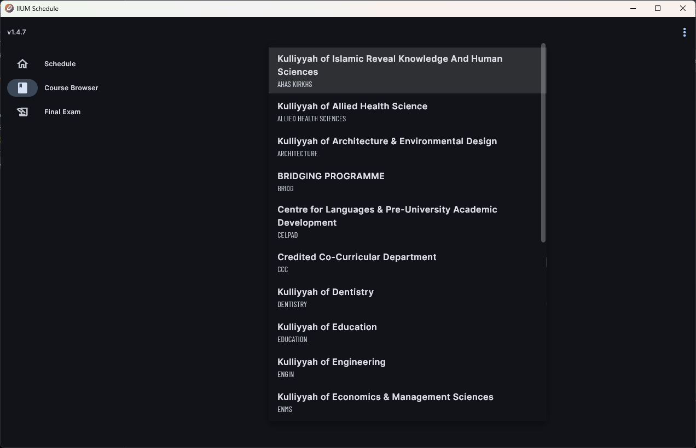

### Highlights

- **Synced kulliyyah lists from IIUM Course Browser**. [Kulliyyah list data](/docs/devs/albiruni#list-of-available-kulliyyah) is now updated to the latest.
- Updated **default academic session and semester** when browsing or creating new schedules (Session `2025/2026`, Semester `1`).

### Other Changes & Improvements

- Added new fonts: **Barlow** and **Barlow Condensed**.
- Added and updated the app logo in the app legalese page.
- Updated About Dialog.
- Upgraded dependencies to their latest versions.
- Updated some UI elements, including adding both full names and short names _(as seen in the online IIUM Course Browser)_ in the course selection dropdown, streamlined the UI for picking kulliyyah and academic session/semester in the schedule maker and course browser, and made the course code a bit bolder in the course browser list.

<figure>

<figcaption>The kulliyyah selector now has full name and course moniker displayed.</figcaption>
</figure>

