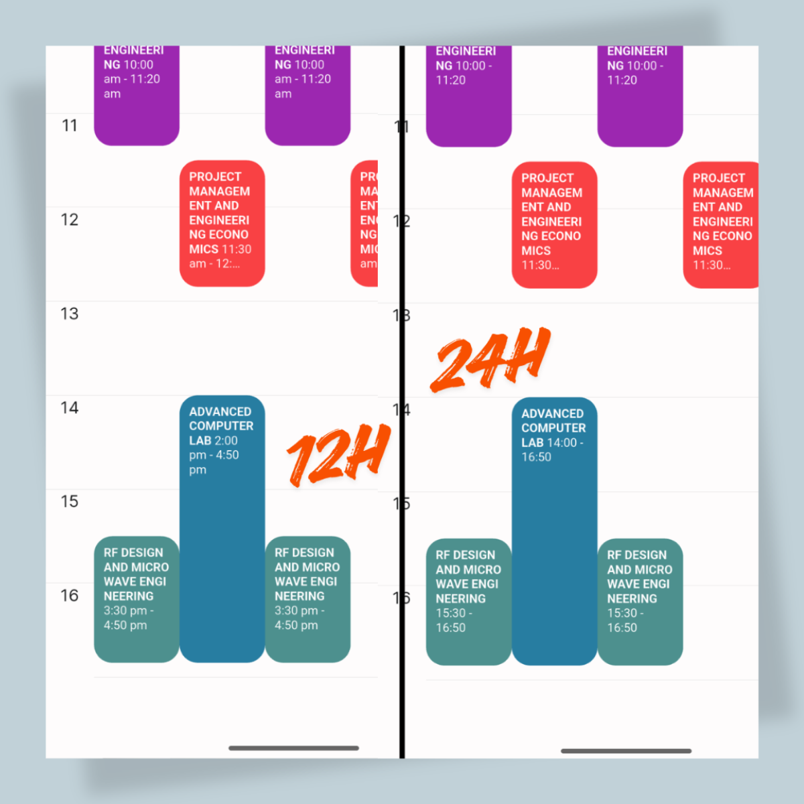

## What's Added

- :sparkles: Added setting to change the **default time format** for timetable UI, Course Browser, and some other places in the app. The setting can be found by tapping ellipsis icon (the three dots) menu in the app's home, then select *"Settings" > "Time Format"*. The default time format is 24-hour format, but you can change it to 12-hour format if you prefer. Related PR [#124](https://github.com/iiumschedule/iium_schedule/pull/124)

- :sparkles: In Course browser page, the navigation now prevents users from going to empty pages. Related PR [#125](https://github.com/iiumschedule/iium_schedule/pull/125)
- :arrow_up: Upgrade dependencies

