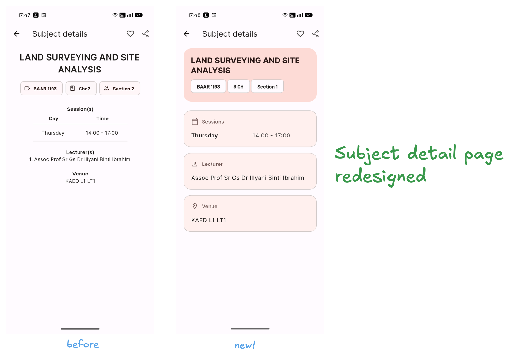

## What's Changed

- Updated default session and semester to **2026/2027 Session 1**
- UI redesign for **subject details** page
- Fix issue where **KSTCL kulliyyah** cannot load. Thanks to IIUM Schedule user who reported this issue.
- Behind the scene improvements and optimizations, including dependencies upgrade, etc.

