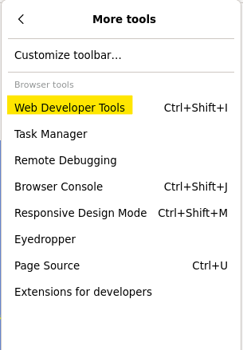
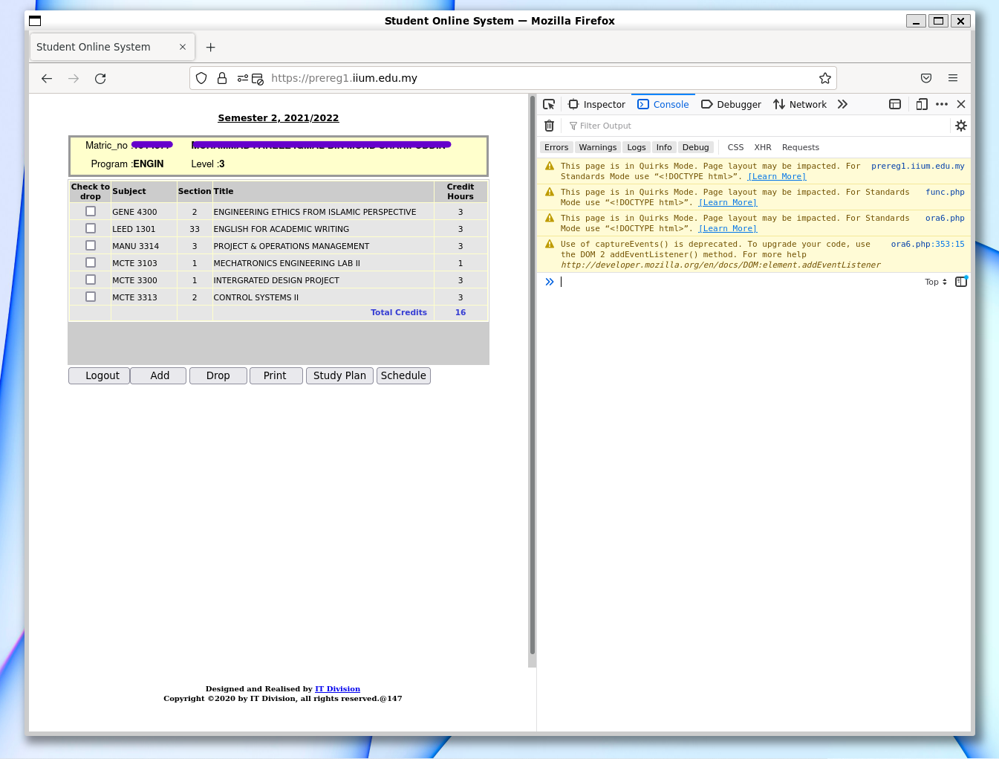
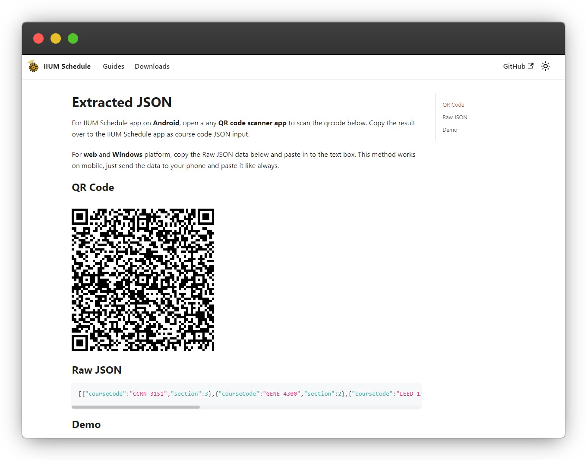
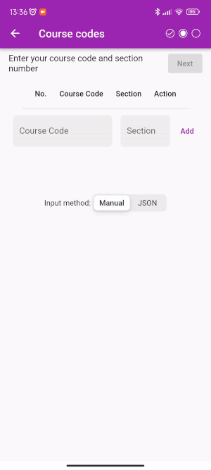

# Extract subjects from Prereg

You are viewing the steps to extract schedule information via **Prereg website**. For i-ma'luum, click [here](../imaluum/).

:::note

You'll need to access the browser's developer tools to follow this guide. Therefore, **only desktop browsers is supported**.

:::

### 1. Open [prereg](https://prereg1.iium.edu.my) website in desktop browser

and login with your credentials.

:::caution HEADS UP

The prereg site can only be accessed during prereg period.

:::

### 2. Open Developer Tools

Press keyboard shortcut <kbd>F12</kbd> or find the **Developer Tools** on your browser.



Then, change to **Console** tab.



**IMPORTANT!** Set the console execution context to **ora6.php**. The code wil fail to run if this step is missing. Shown below are the examples from Firefox and Chrome.

<details>
  <summary>For Chrome (and other chromium based browser)</summary>
  <div>
  <p>In the console, look for dropdown button that says <b>Top</b>. Then, change it to <b>ora6.php</b> as shown below. </p>
    
  </div>
</details>

<details>
  <summary>For Firefox</summary>
  <div>
  <p>In the console, below the log messages, look for dropdown button that says <b>Top</b>. Then, change it to <b>ora6.php</b> as shown below. </p>
    
  </div>
</details>

### 3. Run script

Next, **copy** the code below and **paste** to the console. Then press <kbd>**Enter**</kbd>.

:::tip

**Firefox** may have paste protection enabled as a security feature. To allow pasting, type `allow pasting` in the console before pasting the code below.

:::

```js
const tableBody =
    document.querySelector("body > table > tbody > tr:nth-child(2) > td > table > tbody > tr > td > table > tbody");

const courseCodes = [];
const sections = [];
const combinedSubjectDatas = [];

const bodyChildren = tableBody.children;

for (let index = 2; index < bodyChildren.length - 1; index++) {
  const element = bodyChildren[index].children;
  const subject = element[1].textContent
  const section = element[2].textContent
  courseCodes.push(subject)
  sections.push(section)
}

// combine code & section
for (let i = 0; i < sections.length; i++) {
  combinedSubjectDatas.push({ courseCode: courseCodes[i], section: parseInt(sections[i]) });
}

const json = JSON.stringify(combinedSubjectDatas);
const myUrl = new URL('https://iiumschedule.iqfareez.com/qrcode');
myUrl.searchParams.append('data', json);
console.log(myUrl.href); // log target url
window.open(myUrl.href); // go to target url
```



### 4. Finish

Finally, paste the JSON result to the app's **JSON input**.


