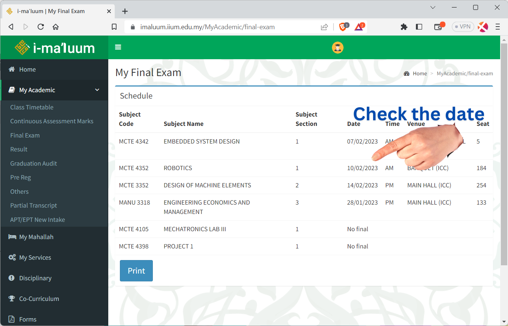
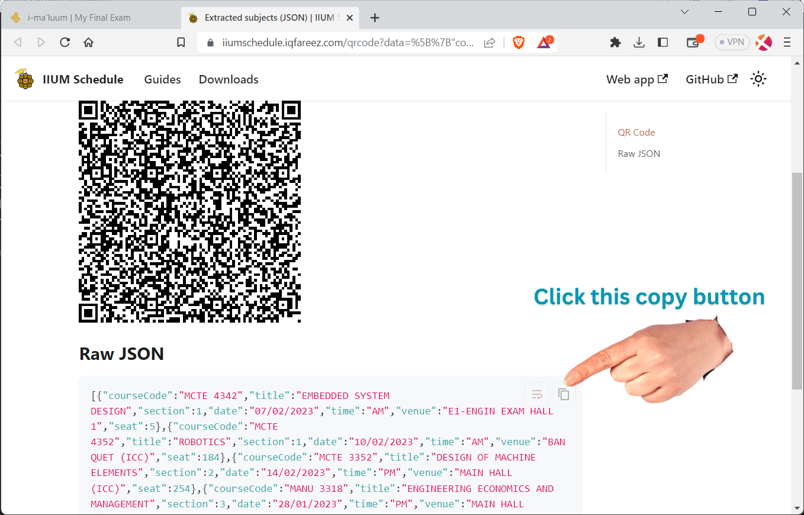

# Extract final exams from i-Ma'luum

:::note

You'll need to access the browser's developer tools to follow this guide. Therefore, **only desktop browsers is supported**.
For Android, you may use **import from i-Ma'luum** directly.

:::

### 1. Open [i-ma'luum](https://imaluum.iium.edu.my) in desktop browser

and navigate to **My Academic >** [**Final Exam**](https://imaluum.iium.edu.my/MyAcademic/final-exam).

Please check that the final exams is already updated for the current semester before proceeding. Otherwise, the app will refuse to add the exams(s).



### 2. Open Developer Tools

Press keyboard shortcut <kbd>F12</kbd> or find the **Developer Tools** on your browser.

Then, change to **Console** tab.

:::info

The steps might be different on **Apple Safari**. Kindly follow this [article](https://balsamiq.com/support/faqs/browserconsole/#apple-safari).

:::

### 3. Run script

Next, **copy** the code below and **paste** to the console. Then press <kbd>**Enter**</kbd>.

:::tip

**Firefox** may have paste protection enabled as a security feature. To allow pasting, type `allow pasting` in the console before pasting the code below.

:::

```js
const tableBody = document.getElementsByClassName("table table-hover")[0];
const data = tableBody.getElementsByTagName("tr");

const extractedData = [];

for (let i = 1; i < data.length; i++) {
    const date = data[i].cells[3].innerText;
    if (date === "No final") continue

    const coursecode = data[i].cells[0].innerText;
    const title = data[i].cells[1].innerText;
    const sect = parseInt(data[i].cells[2].innerText);
    const time = data[i].cells[4].innerText;
    const venue = data[i].cells[5].innerText;
    const seat = parseInt(data[i].cells[6].innerText);

    extractedData.push({
        courseCode: coursecode,
        title: title,
        section: sect,
        date: date,
        time: time,
        venue: venue,
        seat: seat,
    });
}

const json = JSON.stringify(extractedData); // data
const myUrl = new URL("https://iiumschedule.iqfareez.com/qrcode");
myUrl.searchParams.append("data", json);
console.log(myUrl.href);
window.open(myUrl.href); // go to target url
```

The script will scrape the exam information. After the process completed, another site will be opened to show the QR code and Raw JSON data. Follow the instruction given there.



### 4. Finish

Finally, Paste the JSON result into the app's **JSON input** (Final Exam > + (Add exam button) > Import JSON.


