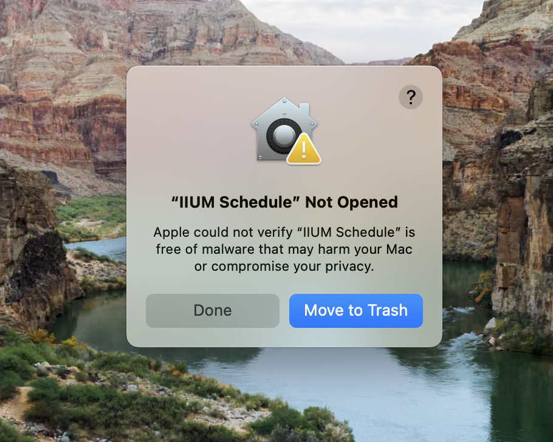
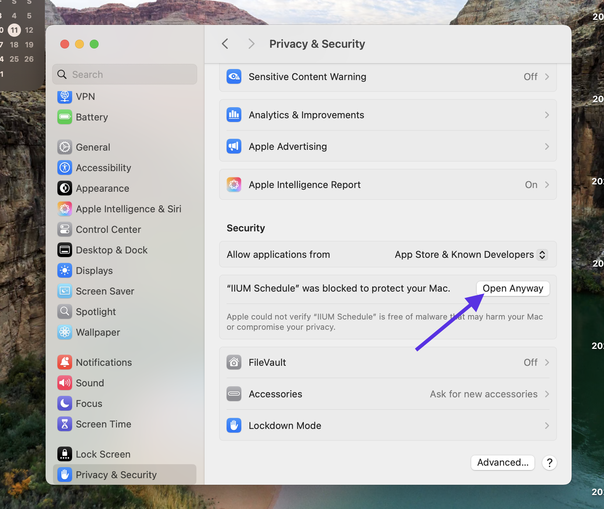

# Allow Blocked App on macOS

If you're trying to open an app on macOS and see a message saying that the app is from an unidentified developer or is blocked, you can follow these steps to allow the app to run:

1. Open Spotlight and search for **Privacy & Security**. Open it.
2. Scroll down to the **Security** section.
3. You should see a message about the blocked app with an **Open Anyway** button. Click on it.
   
4. A confirmation dialog will appear. Click **Open** to confirm.
5. The app should now open successfully.
