# Install app certificates on Windows

:::info

To run an app package that is not coming from Microsoft Store, a certificate needs to be installed on the machine beforehand.

:::

Following are the steps to install the bundled certificate for the IIUM Schedule app.

1. Right-click the installer (`.msix` file) to open its **Properties**. Then, go to the **Digital Signatures** tab.

   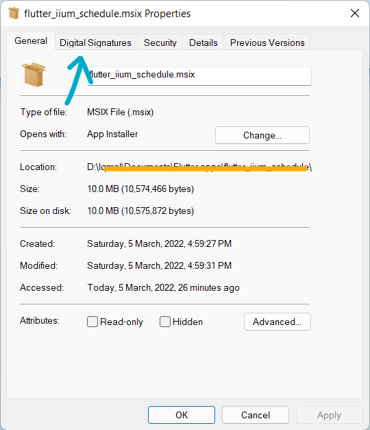

2. Double click on the certificate

   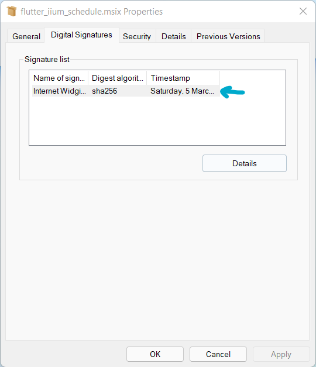

3. Then, click on the <kbd>View Certificate</kbd>

   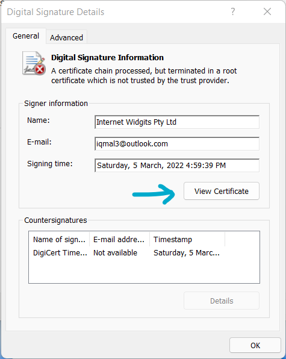

4. Click on the <kbd>Install Certificate...</kbd>

   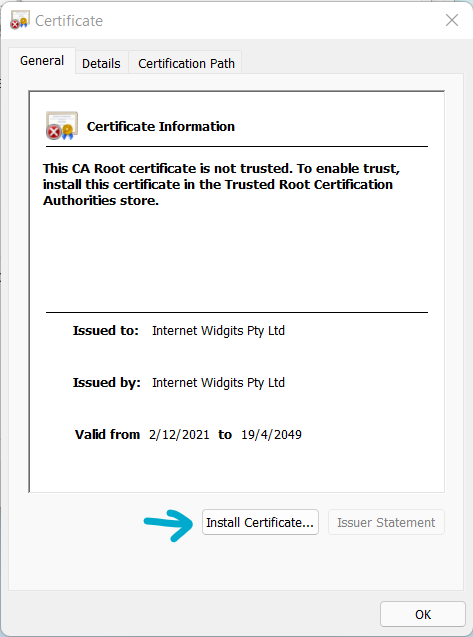

5. A **Certificate Import Wizard** will pop up. In the store location, change to **Local Machine**.

   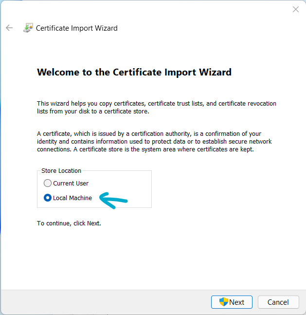

6. Click the **Place all certificates in the following store** button. Then, click on <kbd>Browse...</kbd>

   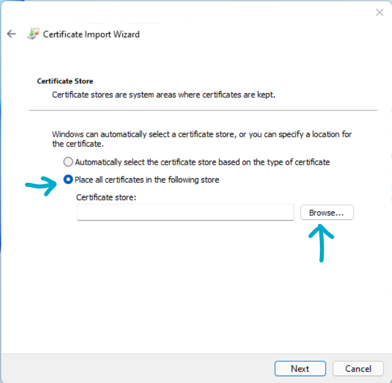

7. A popup window will show displaying all the machine's certificate folders. Select the **Trusted Root Certification Authorities**. Then, click <kbd>OK</kbd>

   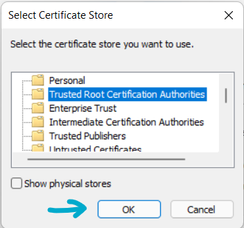

8. Click <kbd>Next</kbd>

   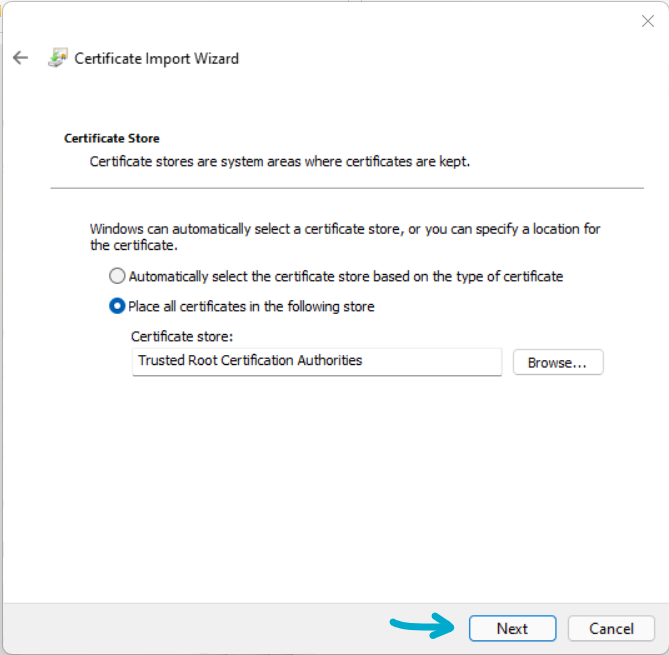

9. Click <kbd>Finish</kbd>

   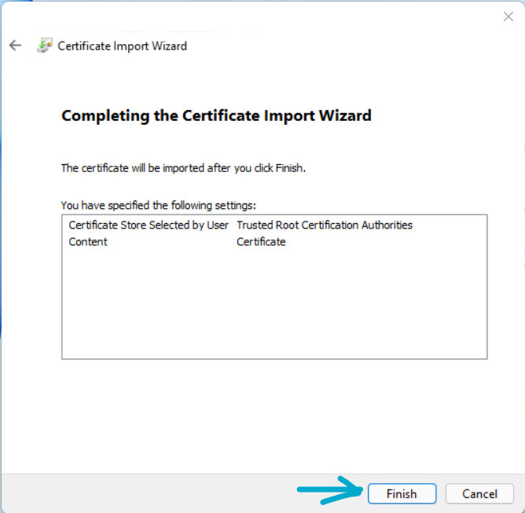

10. A dialog will show to indicate the certificate installation is successful. Click <kbd>OK</kbd> to close it.

    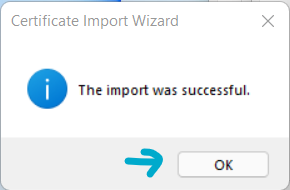

11. Close all the properties & certificate windows.

12. Finally, **re-run the installer**. There should be no error message etc. Click on <kbd>Install</kbd> to finish the installation.

    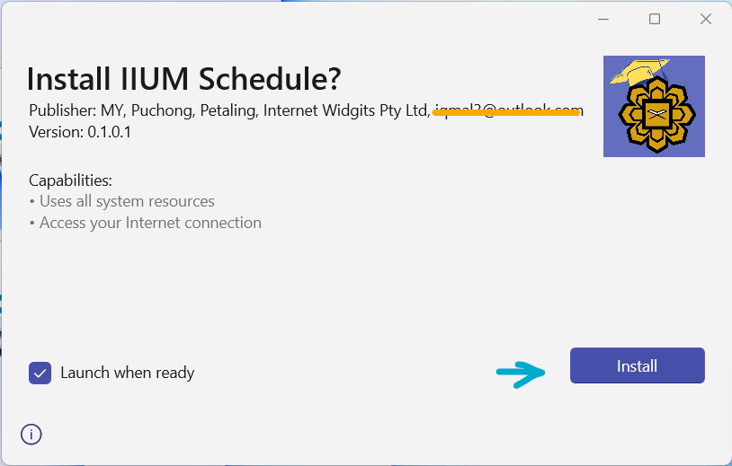
